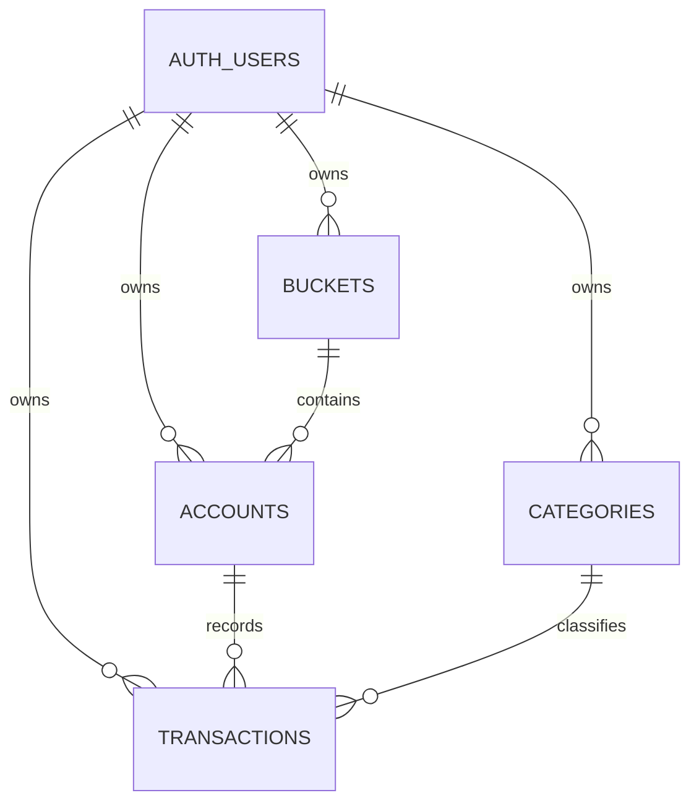

# Database Schema

The database uses PostgreSQL through Supabase. All application tables are in
the `public` schema and are scoped to a Supabase Auth user (`auth.users.id`).
Row-level security (RLS) is enabled on every application table.

The `pgcrypto` extension provides `gen_random_uuid()` for primary keys.

## Relationships



Composite foreign keys include `user_id`, preventing records from referencing
another user's buckets, accounts, or categories.

## Tables

### `public.buckets`

Groups accounts and defines their display currency.

| Column | Type | Constraints / Default |
| --- | --- | --- |
| `id` | `uuid` | Primary key; defaults to `gen_random_uuid()` |
| `user_id` | `uuid` | Required; references `auth.users(id)` with cascade delete |
| `name` | `text` | Required; unique per user |
| `color` | `text` | Required; defaults to `#ffffff` |
| `currency` | `text` | Required; defaults to `$` |

Additional unique constraint: `(id, user_id)`, used as a composite foreign-key
target.

### `public.categories`

User-defined transaction categories.

| Column | Type | Constraints / Default |
| --- | --- | --- |
| `id` | `uuid` | Primary key; defaults to `gen_random_uuid()` |
| `user_id` | `uuid` | Required; references `auth.users(id)` with cascade delete |
| `name` | `text` | Required; unique per user |
| `color` | `text` | Required; defaults to `#ffffff` |

Additional unique constraint: `(id, user_id)`, used as a composite foreign-key
target.

### `public.accounts`

Financial accounts belonging to a bucket.

| Column | Type | Constraints / Default |
| --- | --- | --- |
| `id` | `uuid` | Primary key; defaults to `gen_random_uuid()` |
| `user_id` | `uuid` | Required; references `auth.users(id)` with cascade delete |
| `bucket_id` | `uuid` | Required; references `(buckets.id, buckets.user_id)` with restrict delete |
| `name` | `text` | Required; unique per user |
| `balance` | `bigint` | Required; defaults to `0` |
| `closed` | `boolean` | Required; defaults to `false` |

Additional unique constraint: `(id, user_id)`, used as a composite foreign-key
target.

`balance` is maintained by the transaction functions described below. There
are no database triggers that update it when transactions are changed directly.

### `public.transactions`

Signed amounts recorded against an account and category. Positive and negative
values affect the account balance accordingly.

| Column | Type | Constraints / Default |
| --- | --- | --- |
| `id` | `uuid` | Primary key; defaults to `gen_random_uuid()` |
| `user_id` | `uuid` | Required; references `auth.users(id)` with cascade delete |
| `account_id` | `uuid` | Required; references `(accounts.id, accounts.user_id)` with restrict delete |
| `category_id` | `uuid` | Required; references `(categories.id, categories.user_id)` with restrict delete |
| `amount` | `bigint` | Required and non-zero |
| `occurred_on` | `date` | Required; defaults to `current_date` |
| `transaction_description` | `text` | Optional |

## Database Functions

All functions are `SECURITY INVOKER`, require an authenticated user, and can
only operate on records owned by `auth.uid()`. Execution is granted to the
`authenticated` role and revoked from `public`.

### `insert_transaction`

```sql
insert_transaction(
  p_account_id uuid,
  p_category_id uuid,
  p_amount bigint,
  p_description text,
  p_occurred_on date default current_date
) returns public.transactions
```

Creates a transaction and adds its signed amount to the account balance. It
validates ownership of the referenced account and category.

### `delete_transaction`

```sql
delete_transaction(p_transaction_id uuid) returns void
```

Deletes a transaction and subtracts its amount from the account balance.

### `update_transaction_amount`

```sql
update_transaction_amount(
  p_transaction_id uuid,
  p_amount bigint
) returns void
```

Changes a transaction amount and adjusts the account balance by the difference
between the old and new amounts.

## Row-Level Security

Authenticated users can only access rows where `user_id = auth.uid()`.

| Table | Select | Insert | Update | Delete |
| --- | --- | --- | --- | --- |
| `buckets` | Yes | Yes | Yes | No policy |
| `categories` | Yes | Yes | Yes | No policy |
| `accounts` | Yes | Yes | Yes | No policy |
| `transactions` | Yes | Yes | Yes | Yes |

Because transaction writes are also allowed directly by RLS, callers should
use the database functions for inserts, amount updates, and deletes to ensure
`accounts.balance` remains consistent.

## Indexes

| Table | Indexed columns |
| --- | --- |
| `buckets` | `user_id` |
| `categories` | `user_id` |
| `accounts` | `user_id`; `bucket_id`; `(user_id, closed)` |
| `transactions` | `user_id`; `account_id`; `category_id`; `(user_id, occurred_on DESC)`; `(account_id, occurred_on DESC)` |

Unique constraints and primary keys also create their own PostgreSQL indexes.
